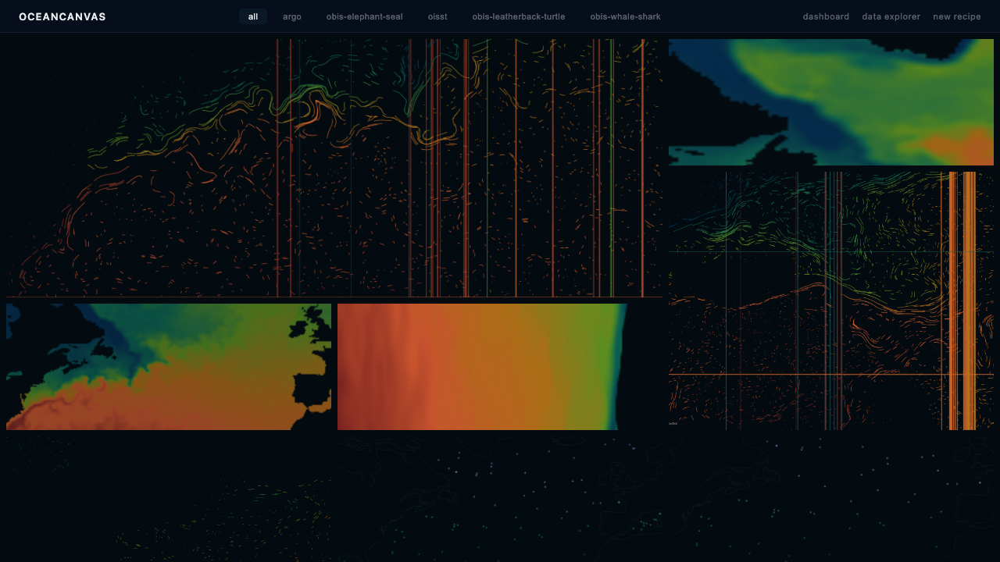
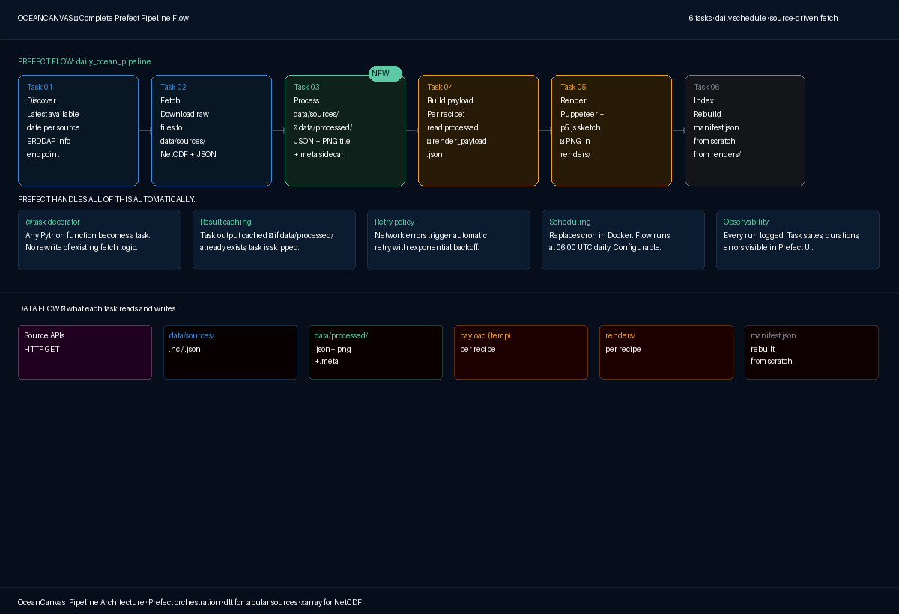
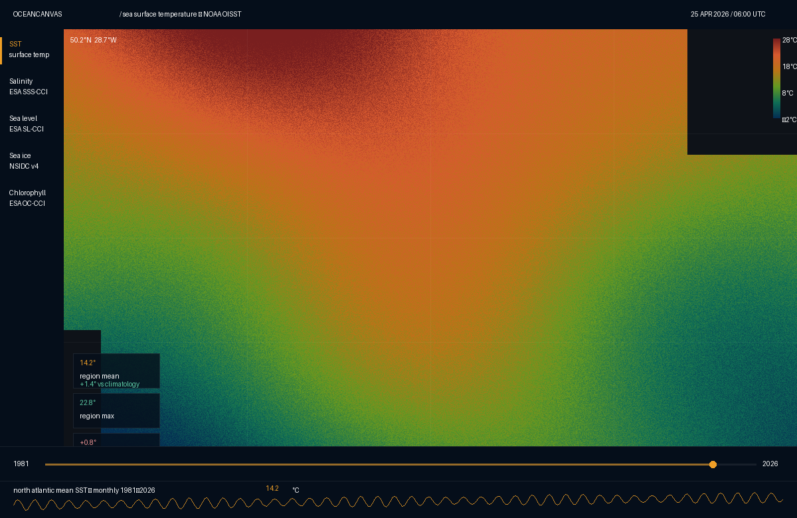
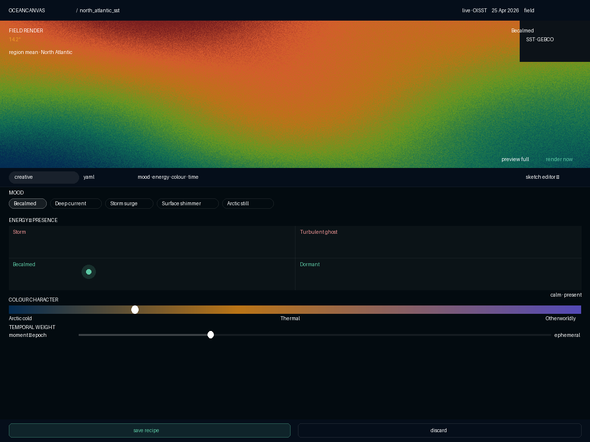
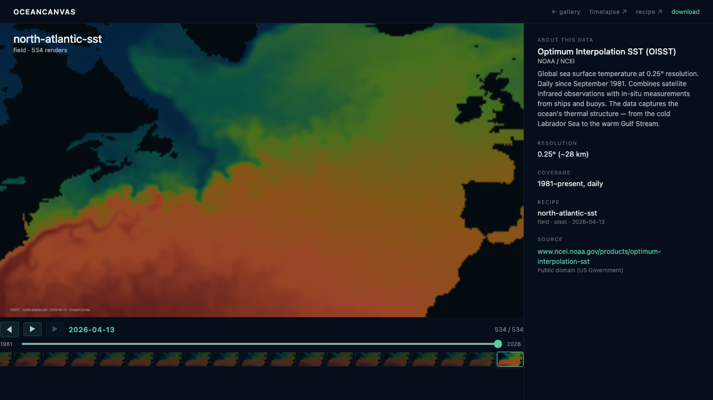
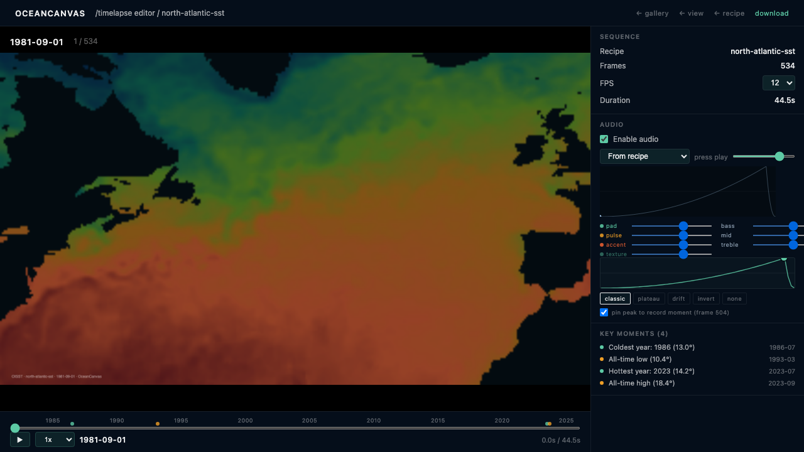

# OceanCanvas

[](https://github.com/chipi/oceancanvas/actions/workflows/ci.yml)
[](https://github.com/chipi/oceancanvas/releases)
[](LICENSE)
[](docs/concept/00-package-introduction.md)

> Generative ocean art that the data performs daily.



A pipeline runs at 06:00 UTC, fetches today's ocean data from open scientific sources, and renders it through authored recipes. Every day adds a frame. A recipe running for a year is a year of art — the same authored character, the ocean changing underneath it. The gallery walks itself forward without curation.

This is not a dashboard. It is not a research tool. It is a project where the ocean's data is treated with editorial dignity, and where authorship and accumulation matter more than dashboards and metrics.

---

## Three ways in

**👀 Just want to see it.** Run it locally and the gallery fills with renders.

```bash
git clone https://github.com/chipi/oceancanvas.git
cd oceancanvas
docker compose up
```

Open `http://localhost:8080`. Need help? → [`docs/quickstart.md`](docs/quickstart.md) for a 5-minute walkthrough; [`docs/get-started.md`](docs/get-started.md) for full setup including local dev and troubleshooting.

**🎨 Want to author a piece.** Recipes are the authored unit — a YAML file describing region, source, render character, audio. The Recipe Editor at `/recipes/new` is the visual front door; the YAML schema is the durable form. → [`recipes/README.md`](recipes/README.md) is the field-by-field author guide with the render-type taxonomy and audio-block reference.

**🛠️ Want to contribute or hack.** The project's conventions live in two documents at the root: [`CLAUDE.md`](CLAUDE.md) (firm orientation — stack, constraints, code style) and [`IMPLEMENTATION.md`](IMPLEMENTATION.md) (the Phase 1 build guide). The doc system itself is what most of the value lives in — see "How to read this repository" below.

---

## What this is

Three concepts hold the project together.

**The recipe.** A YAML file authored by a person — region, source, render type, creative parameters. Once authored, it runs forever. Tomorrow at 06:00 UTC the pipeline reads it, fetches that region's data for that source, and renders it. The recipe is the authored work; each render is the data sitting for the work that day.

**The pipeline.** Six tasks in a Prefect flow, running daily. Discover the latest available date per source. Fetch raw data. Process it into a browser-friendly intermediate format. Build a render payload per recipe. Render via Puppeteer + p5.js. Rebuild the manifest. The output is one PNG per recipe per day, on disk.



**The gallery.** A static React app that reads the manifest. Today's renders fill the front page. The fourteen-day strip below shows recent history. The grid below that shows every active recipe. No editor curated it. No engagement metrics measure it. The pipeline ran at 06:00 UTC and the gallery reflects what it produced.

---

## The four surfaces

The customer-facing surfaces — Dashboard, Recipe Editor, Gallery, Video Editor — close the creative loop: read the data, author a piece, watch it accumulate, assemble a year into a film.

| | |
|---|---|
|  |  |
| **Dashboard.** Read the data. Source rail (SST · Argo · biologging), live region stats, "create a recipe from this region" CTA. | **Recipe Editor.** Author a piece. Mood presets, energy × presence quadrant, colour character, audio mapping — flip to the YAML pill for the durable form. |
|  |  |
| **Gallery.** Watch it accumulate. Per-recipe detail page with timeline scrubber across years (or decades) of accumulated renders. | **Video Editor.** Assemble a year into a film. Multi-channel mixer, EQ, tension-arc editor that shapes audio dynamics + visual filters in unison. |

---

## Status

**Phase 1 — v0.5.0 shipped May 2026.** Daily pipeline + four customer-facing surfaces + generative audio + audio-video coupling are all live. See [`CHANGELOG.md`](CHANGELOG.md) for the full history; [GitHub releases](https://github.com/chipi/oceancanvas/releases) for prose-formatted release notes.

Phase 1 ships:

- The pipeline running daily, self-hosted via Docker Compose
- Sources live: NOAA OISST sea surface temperature, Argo float density, OBIS biologging (whale shark, leatherback, elephant seal)
- 11 authored recipes accumulating monthly renders back to 1981
- All four customer-facing surfaces — Dashboard, Recipe Editor, Gallery, Video Editor
- Generative audio (RFC-010 → ADR-027) and tension-arc audio-video coupling (RFC-011 → ADR-028)

Phase 2 (later) will add public hosting and additional editorial features. Phase 1 stays open-by-default, file-based, and self-hostable.

---

## How to read this repository

OceanCanvas's documentation has two layers — a concept package at the project root, and a living definition tree under `docs/`.

### The concept package — read end-to-end, once

| Document | What it holds |
|---|---|
| [`OC-00 Package Introduction`](docs/concept/00-package-introduction.md) | Overview of the package and its parts |
| [`OC-01 Vision`](docs/concept/01-vision.md) | Why the project exists |
| [`OC-02 Project Concept`](docs/concept/02-project-concept.md) | What the surfaces are and how the creative loop works |
| [`OC-03 Data Catalog`](docs/concept/03-data-catalog.md) | Which sources are integrated and which are deferred |
| [`OC-04 Pipeline Architecture`](docs/concept/04-pipeline-architecture.md) | How the pipeline is built, conceptually |
| [`OC-05 Design System & Creative Direction`](docs/concept/05-design-system.md) | The visual character |

Read these once or twice for the *why*. They are updated rarely.

### The definition tree — read selectively, when working on something

```
docs/
├── prd/                 Product — user-value arguments per surface
│   ├── OC_PA.md         Reference: audiences · promises · principles
│   └── PRD-001..NNN.md  Per-surface arguments, blog-post format
│
├── uxs/                 UX — visual contracts per surface
│   ├── OC_IA.md         Reference: surfaces · navigation · shared tokens
│   └── UXS-001..NNN.md  Per-surface design tokens, layout, states
│
├── rfc/                 Tech, moving tier — open technical questions
│   └── RFC-001..NNN.md  Open questions with alternatives and trade-offs
│
└── adr/                 Tech, settled tier — locked decisions
    ├── OC_TA.md         Reference: components · contracts · constraints · stack · state map
    └── ADR-001..NNN.md  Per-decision records, append-only
```

Read what you need when you need it. Reference docs (PA / IA / TA) are linked into, not read end-to-end. Per-artifact docs are read when working on the thing they describe.

---

## Working on the project

| Document | When to read |
|---|---|
| [`CLAUDE.md`](CLAUDE.md) | Always, before working on the codebase. Stack, constraints, code style, doc rules, voice. Written for AI-assisted work; reads cleanly for humans. |
| [`IMPLEMENTATION.md`](IMPLEMENTATION.md) | Phase 1 build guide — slices, gates, scope. |
| [`CONTRIBUTING.md`](CONTRIBUTING.md) | When proposing a change. Values + checklist. |
| [`CHANGELOG.md`](CHANGELOG.md) | Release history at a glance. |
| Per-package READMEs | When working in `gallery/`, `pipeline/`, `sketches/`, or `recipes/`. Each holds a focused entry-point doc. |

---

## License

[MIT](LICENSE). The data this project performs is open by default; the code that performs it is too.

Acknowledgement of dependencies: open scientific data from NOAA, ESA, NASA, NSIDC, and the broader open ocean-data ecosystem. The data is the work; this project is one way of looking at it.
